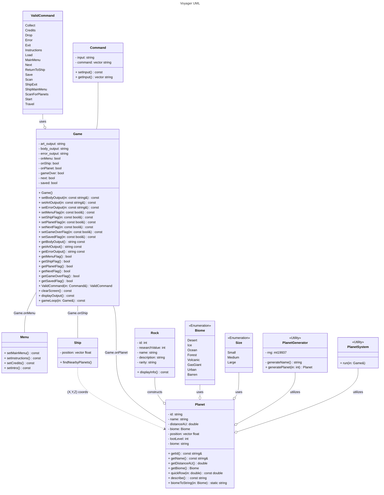

```mermaid
---
title: Voyager UML
---
classDiagram
	ValidCommand --o Game : uses
	Command -- Game
	Game -- Menu : Game.onMenu
	Game -- Ship : Game.onShip
	Ship ..> Planet : (X,Y,Z) coords
	Game -- Planet : Game.onPlanet
	Rock --o Planet : constructs
	Biome --o Planet : uses
	Size --o Planet : uses
	PlanetGenerator --o Planet : utilizes
	PlanetSystem --o Planet : utilizes


	class Game{
	    - art_output: string
	    - body_output: string
	    - error_output: string
	    - onMenu: bool
	    - onShip: bool
	    - onPlanet: bool
		- gameOver: bool
		- next: bool
		- saved: bool
	    + Game()

	    + setBodyOutput(in: const string&) const
		+ setArtOutput(in: const string&) const
		+ setErrorOutput(in: const string&) const
		+ setMenuFlag(in: const bool&) const
		+ setShipFlag(in: const bool&) const
		+ setPlanetFlag(in: const bool&) const
		+ setNextFlag(in: const bool&) const
		+ setGameOverFlag(in: const bool&) const
		+ setSavedFlag(in: const bool&) const
	    + getBodyOutput() string const
	    + getArtOutput() string const
	    + getErrorOutput() string const
		+ getMenuFlag() bool
		+ getShipFlag() bool
		+ getPlanetFlag() bool
		+ getNextFlag() bool
		+ getGameOverFlag() bool
		+ getSavedFlag() bool
		+ ValidCommand(in: Command&) ValidCommand
		+ clearScreen() const
		+ displayOutput() const
	    + gameLoop(in: Game&) const
	}

	class Command{
		- input: string
		- command: vector string
	    + setInput() const
	    + getInput() vector string
	}

	class Menu{
		+ setMainMenu() const
		+ setInstructions() const
		+ setCredits() const
		+ setIntro() const
	}

	class Ship {
		- position: vector float
		+ findNearbyPlanets()
	}

	class Planet {
		- id: string
		- name: string
		- distanceAU: double
		- biome: Biome
		- position: vector float
		- lootLevel: int
		- biome: string
		+ getId() const string&
		+ getName() const string&
		+ getDistanceAU() double
		+ getBiome() Biome
		+ quickRow(in: double) const double
		+ describe() : const string
		+ biomeToString(in: Biome) static string
	}

	class Rock {
		- id: int
		- researchValue: int
		- name: string
		- description: string
		- rarity: string
		+ displayInfo() const
	}
	class ValidCommand {
		Collect
        Credits
        Drop
        Error
        Exit
        Instructions
        Load
        MainMenu
        Next
        ReturnToShip
        Save
        Scan
        ShipExit
        ShipMainMenu
        ScanForPlanets
        Start
        Travel
	}
	class Biome{
		<<Enumeration>>
		Desert
		Ice
		Ocean
		Forest
		Volcanic
		GasGiant
		Urban
		Barren
	}
	class Size{
		<<Enumeration>>
		Small
		Medium
		Large
	}
	class PlanetGenerator {
		<<Utility>>
		- rng: mt19937
		- generateName() string
		+ generatePlanet(in: int) Planet
	}
	class PlanetSystem{
		<<Utility>>
		+ run(in: Game&)
	}
```
