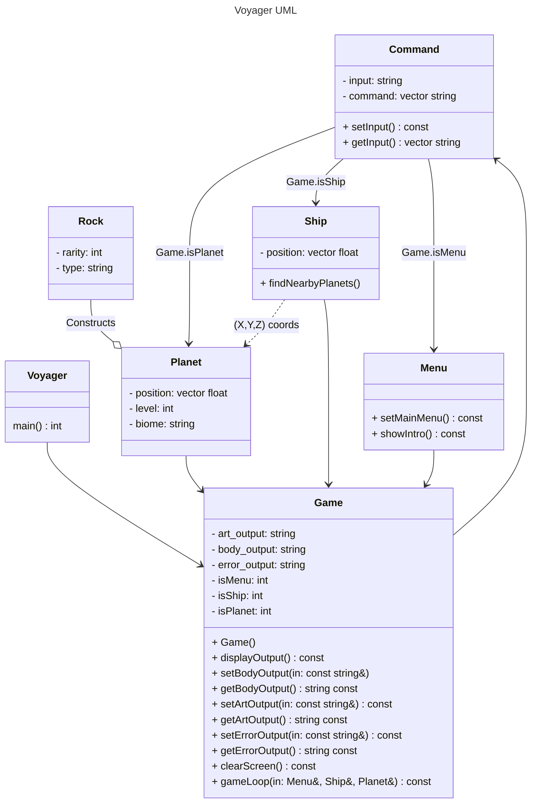

```mermaid
---
title: Voyager UML
---	

classDiagram
	Rock --o Planet : Constructs
	Voyager --> Game
	Command --> Planet : Game.isPlanet
	Command --> Ship : Game.isShip
	Command --> Menu : Game.isMenu
	Planet --> Game
	Ship --> Game
	Menu --> Game
	Command <-- Game
	Ship ..> Planet : (X,Y,Z) coords
	
	class Voyager {
		main() int
	}
	
	class Game{
	    - art_output: string
	    - body_output: string
	    - error_output: string
	    - isMenu: int
	    - isShip: int
	    - isPlanet: int
	    + Game()
	    + displayOutput() const
	    + setBodyOutput(in: const string&)
	    + getBodyOutput() string const
	    + setArtOutput(in: const string&) const
	    + getArtOutput() string const
	    + setErrorOutput(in: const string&) const
	    + getErrorOutput() string const
	    + clearScreen() const
	    + gameLoop(in: Menu&, Ship&, Planet&) const
	}
	
	class Command{
		- input: string
		- command: vector string
	    + setInput() const
	    + getInput() vector string
	}
    
	class Menu{
		+ setMainMenu() const
		+ showIntro() const
	}
	
	class Ship {
		- position: vector float
		+ findNearbyPlanets()
	}
	
	class Planet {
		- position: vector float
		- level: int
		- biome: string
	}
	
	class Rock {
		- rarity: int
		- type: string
	}
```