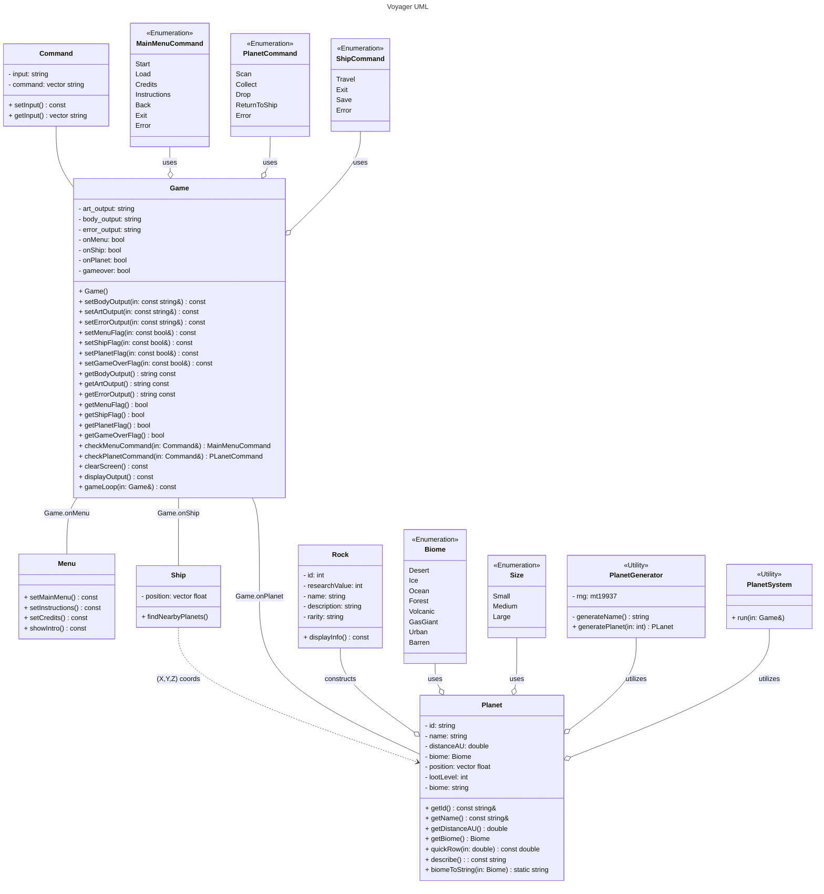

```mermaid
---
title: Voyager UML
---	

classDiagram
	Command -- Game
	MainMenuCommand --o Game : uses
	PlanetCommand --o Game : uses
	ShipCommand --o Game : uses
	Game -- Menu : Game.onMenu
	Game -- Ship : Game.onShip


	Ship ..> Planet : (X,Y,Z) coords
	Game -- Planet : Game.onPlanet
	Rock --o Planet : constructs
	Biome --o Planet : uses
	Size --o Planet : uses
	PlanetGenerator --o Planet : utilizes
	PlanetSystem --o Planet : utilizes

	
	class Game{
	    - art_output: string
	    - body_output: string
	    - error_output: string
	    - onMenu: bool
	    - onShip: bool
	    - onPlanet: bool
		- gameover: bool
	    + Game()

	    + setBodyOutput(in: const string&) const
		+ setArtOutput(in: const string&) const
		+ setErrorOutput(in: const string&) const
		+ setMenuFlag(in: const bool&) const
		+ setShipFlag(in: const bool&) const
		+ setPlanetFlag(in: const bool&) const
		+ setGameOverFlag(in: const bool&) const
	    + getBodyOutput() string const
	    + getArtOutput() string const
	    + getErrorOutput() string const
		+ getMenuFlag() bool
		+ getShipFlag() bool
		+ getPlanetFlag() bool
		+ getGameOverFlag() bool
		+ checkMenuCommand(in: Command&) MainMenuCommand
		+ checkPlanetCommand(in: Command&) PLanetCommand
		+ clearScreen() const
		+ displayOutput() const
	    + gameLoop(in: Game&) const
	}
	
	class Command{
		- input: string
		- command: vector string
	    + setInput() const
	    + getInput() vector string
	}
    
	class Menu{
		+ setMainMenu() const
		+ setInstructions() const
		+ setCredits() const
		+ showIntro() const
	}
	
	class Ship {
		- position: vector float
		+ findNearbyPlanets()
	}
	
	class Planet {
		- id: string
		- name: string
		- distanceAU: double
		- biome: Biome
		- position: vector float
		- lootLevel: int
		- biome: string
		+ getId() const string&
		+ getName() const string&
		+ getDistanceAU() double
		+ getBiome() Biome
		+ quickRow(in: double) const double
		+ describe() : const string
		+ biomeToString(in: Biome) static string
	}
	
	class Rock {
		- id: int
		- researchValue: int
		- name: string
		- description: string
		- rarity: string
		+ displayInfo() const
	}
	class MainMenuCommand{
		<<Enumeration>>
		Start
		Load
		Credits
		Instructions
		Back
		Exit
		Error
	}
	class PlanetCommand{
		<<Enumeration>>
		Scan
		Collect
		Drop
		ReturnToShip
		Error
	}
	class ShipCommand{
		<<Enumeration>>
		Travel
		Exit
		Save
		Error
	}
	class Biome{
		<<Enumeration>>
		Desert
		Ice
		Ocean
		Forest
		Volcanic
		GasGiant
		Urban
		Barren
	}
	class Size{
		<<Enumeration>>
		Small
		Medium
		Large
	}
	class PlanetGenerator {
		<<Utility>>
		- rng: mt19937
		- generateName() string
		+ generatePlanet(in: int) PLanet
	}
	class PlanetSystem{
		<<Utility>>
		+ run(in: Game&)
	}
```